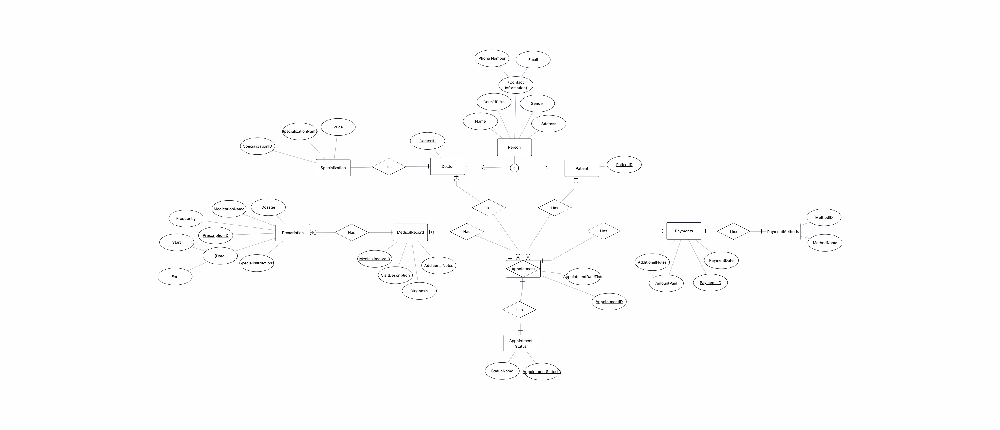
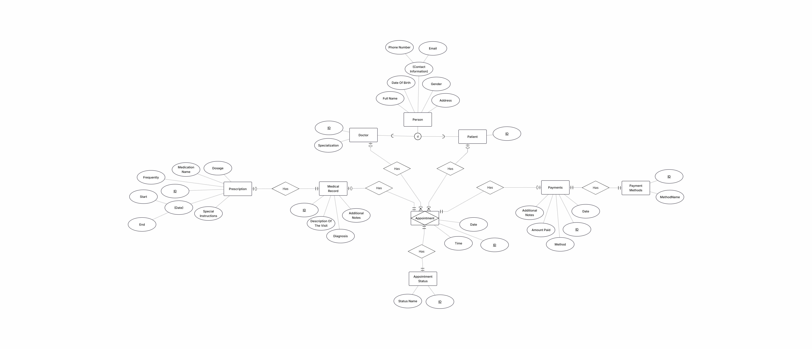

# 📁 Database – ClinicDB
## Overview

This database is designed to support a small to medium-sized medical clinic management system.
It focuses on data integrity, clear relationships, and real-world clinic workflows such as appointments, medical records, payments, and prescriptions.

The database is implemented using SQL Server and follows a normalized relational design.

---

## 🧱 Core Design Principles

Separation of Persons, Doctors, and Patients

Strong use of foreign keys to enforce relationships

Business rules implemented using CHECK constraints

Readability and performance enhanced with indexes and views

Real-world validation (e.g. Egyptian phone numbers, gender rules)

---

## 📊 Main Tables Overview
### 1. Persons

Stores general personal information used by both doctors and patients.

**Key Features**

- Phone number validation (Egyptian format)
- Gender validation (M, F, or NULL)
- Date of birth cannot be in the future
- Indexed by Name and PhoneNumber for fast search

### 2. Doctors

Links a person to a medical specialization.

**Relationships**

- PersonID → Persons
- SpecializationID → Specializations

### 3. Patients

Represents clinic patients linked to personal data.

**Relationships**

- PersonID → Persons

### 4. Specializations

Defines medical specializations and their base price.

**Key Constraints**

- Unique specialization name
- Minimum name length validation
- Default price set to 0

### 5. Appointments

Handles booking and tracking of clinic appointments.

**Features**

- Appointment date & time
- Appointment type (Examination or Consultation)
- Status-based workflow
- Optional linkage to medical records and payments

**Relationships**

- Patient
- Doctor
- Appointment Status
- Medical Record
- Payment

### 6. AppointmentStatus

Controls appointment lifecycle (Pending, Confirmed, Completed, etc.).

**Design Choice**

- Status values stored in a separate table for flexibility and clarity.

### 7. MedicalRecords

Stores visit details, diagnosis, and notes for patient visits.

### 8. Prescriptions

Stores medication details linked to medical records.

**Business Rules**

- Start date defaults to current date
- End date must be after start date
- Default instructions provided if none entered

### 9. Payments & PaymentMethods

Handles financial transactions and payment methods.

**Key Rules**

- Amount cannot be negative
- Payment method must exist
- Supports notes and multiple payment types

---

## 👁️ Database Views

The database includes several views to simplify querying and reporting:

### DoctorsDetails

Combines doctor, person, and specialization data.

### PatientsDetails

Combines patient and personal data.

### Reservations

Displays appointment details with patient, doctor, specialization, and status.

### TodayAppointments

Optimized view for daily clinic operations and payment overview.

---

## 🔐 Data Integrity & Validation

- Extensive use of CHECK constraints
- Enforced foreign key relationships
- Default values to prevent incomplete records
- Indexes on frequently queried columns

---

## 📦 Backup File

The database backup is provided as:
```bash
ClinicDB.bak
```
It can be restored using SQL Server Management Studio.

---

## 🗺️ Database Schema




---

## 🧠 Design Scope

This database is designed for:

- Educational purposes
- Portfolio demonstration
- Small clinic usage

It can be extended to support:

- User authentication
- Audit logs
- Insurance integration
- Reporting modules

